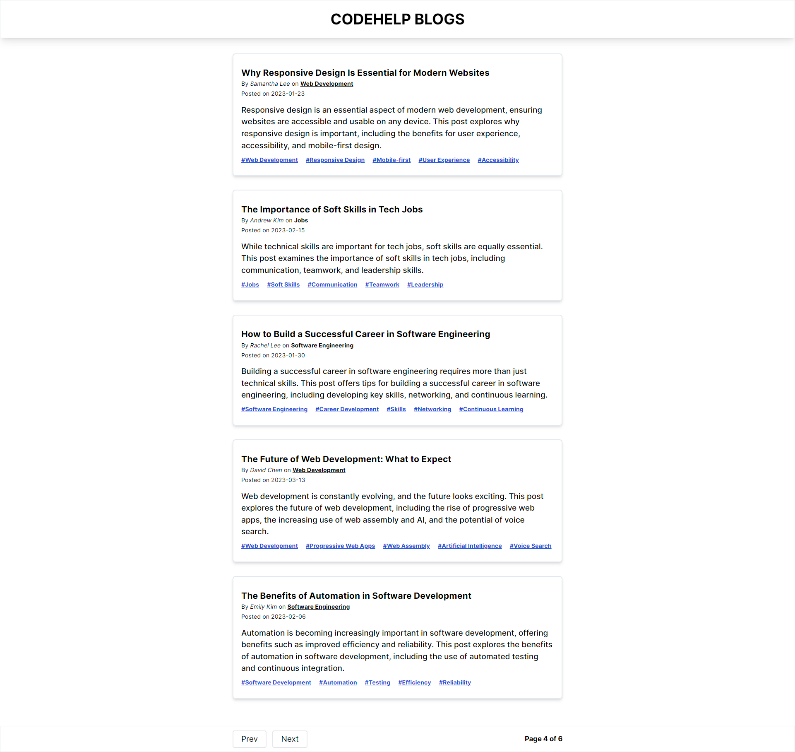

# CodeHelp Blogs WebApp using React JS

## Project ScreenShots

## Project URL

- [Live URL](https://codehelp-blogs-website-react.netlify.app/)
- [Solution](https://github.com/Psargar616/blogs-context-starter)

